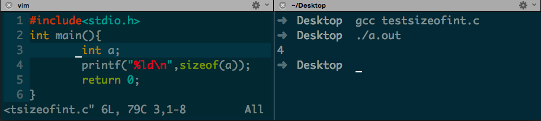
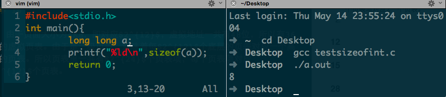

Assignment 3
====
###包昱嘉 5120719015
___

### 3
使用位图来记录存储空间时，由于内存大小为128MB，一个单元大小为 $n$ 字节，所以一共会分成
$\frac{128 \times 2^{20}}{n}$
个单位。由于位图采用0，1来记录每个内存单位是否空闲，所以每个单位占用一个bit。 总计需
$\frac{2^{24}}{n} Byte$
的存储空间。

当使用链表来记录内存使用情况时，由于数据段和空闲区交替排列且长度均为64KB，所以一共会产生
$\frac{128\times 2^{10}}{64} = 2^{11}$
个节点。每个节点的大小为
$32+16+16=64\ bits=8\ Bytes$
总计需$2^{14}\ Byte$的存储空间。

通过解不等式$$\frac{2^{24}}{n}>2^{14}$$我们可以知道当$n<2^{10}$，即$n<1KB$时，使用链表来记录内存使用情况所占用的空间存储空间更小。当$n>1KB$时，使用位图来记录内存使用情况所占用的存储空间更小。另外由于数据区和空闲区以64KB交替排列，所以n的取值应该小于64KB，且64/n尽量要是整数，否则使用位图管理时每个片段里都会存在内零头。
### 4
使用首次适配算法：
a)->20KB, b)->10KB, c)->18KB

使用最佳适配算法：
a)->12KB, b)->10KB, c)->9KB

使用最差适配算法：
a)->20KB, b)->18KB, c)->15KB

使用下次适配算法：
a)->18KB, b)->20KB, c)->9KB
### 5
十进制转换为二进制：

+ 20000 -> 100111000100000  
+ 32786 -> 1000000000000000  
+ 60000 -> 1110101001100000

页面大小为4KB,即 $2^{12}$B，截取后12位为偏移量，后12位之前表示页号，得：

+ 20000 -> 100 + 111000100000 -> 虚拟页号为4，偏移量为3616
+ 32786 -> 1000 + 000000000000 -> 虚拟页号为8，偏移量为0
+ 60000 -> 1110 + 101001100000 -> 虚拟页号为14，偏移量为2656

页面大小为8KB，截取后13位为偏移量，后13位之前表示页号，得：

+ 20000 -> 10 + 0111000100000 -> 虚拟页号为2，偏移量为3616
+ 32786 -> 100 + 0000000000000 -> 虚拟页号为4，偏移量为0
+ 60000 -> 111 + 0101001100000 -> 虚拟页号为7，偏移量为2656

### 7
首先我通过`sizeof`函数获取C程序中一个int类型的大小是4B。
  

1. 每次执行引起TLB失效，即每次循环都要换页。页面大小为4KB，所以步长M应选取$\frac{4KB}{4B}=1024$。第一次执行这个循环时，N对于访问数组产生的换页并没有影响，因为TLB中并没有相应存储的记录。如果为了至少在循环中产生一次换页，即循环至少走一次，保证 $N>0$即可。

2. 循环重复许多次对于M的取值并没有影响，为了使每次访问都需要换页，M仍然取1024. 对于N来说，由于TLB有64个，所以N应取到保证循环次数大于64次，即N要至少为64. 这时第二次循环时第一次循环所存入的TLB的对应访问的值正好被替换出去了，每次访问仍然需要换页。

### 10

1. 由于页面大小为4KB，即对应$2^{12}$，虚拟地址一共有48位，所以有36位的虚拟页表。由于是一级页表，意味着每$2^{12}$个底层的页表对应一个高级的页表。所以页表里一共有$2^{24}$个页表项，每个页表项对应$2^{12}$个页表。
2. 首先通过`sizeof()`函数获得`long long`类型的大小，为8KB。
  
一个4KB大小的页面能存储512个`long long`类型的长整型，对于数组元素每读取512个长整型后将会发生一次TLB失效。  
另外程序指令由于一直在执行，所以在运行一次后会一直在TLB中，不会产生失效。

### 12
由于$32-9-11=12$，所以还剩下12位用来表示页面偏移量。推知一个页面大小为$2^{12}B=4KB$

在地址空间中一共有 $2^{9}\times2^{11}=2^{20}$ 个页面

### 15
设$n+1$次内存访问会产生1次TLB失效，为使的平均开销为2ns，解方程
$$\frac{5+n}{n+1}=2$$
得 $n=3$， 于是命中率为 $$\frac{n}{n+1}=\frac{3}{4}=0.75$$

### 28
1. 由于页面2没有被访问没有被修改，所以使用NRU算法先置换页面2
2. 由于页面3的装入时间最早，所以使用FIFO算法先置换页面3
3. 由于页面1上次访问时间最早，所以使用LRU算法先置换页面1
4. 使用第二次机会算法，首先页面三装入时间最早，但是由于页面三R位为1，所以将其R位清零放置链表末端。之后发现是页面零，但是由于页面零的R位也是1，所以继续将其R位清零放在链表末端。之后是页面二，其R位为零，所以置换页面2.

### 31
1. 页面大小为 4096B 时  
32768/4096 = 8  
16386/4096 = 4.000488281  
15870/4096 = 3.874511719  
一共需要$8+5+4 ＝ 17$个页面。而 $17 \times 4096 = 69632 > 65536$ 故这个程序无法全部装入地址空间。

2. 页面大小为 512B 时
32768/512 = 64
16386/512 = 32.00390625
15870/512 = 30.99609375
一共需要$64+33+31 = 128$个页面，占 $128\times512 = 65536$B 正好能放入这个地址空间。

因而可以看出页面大小越小，产生的内零头越少，利用率更高。但是相对的页面数量会大大增加。

### 32
对于支持共享页面的操作系统存在这种可能使的一个页面同一时刻在两个进程的工作集中。可能两个进程都是在读同一个数据，那样它们就可以共享相应的页面。同样的例如在执行`fork()`函数后，生成的子进程和父进程在初始时刻是共享内存，直到两者执行不同的指令才会对应拷贝内存地址空间进行相应变化。共享页面可以提高系统的性能。

### 37
1. 读取成功，实际内存地址为（14，13）
2. 存储失败，由于段0没有写入的权限
3. 缺页中断
4. 跳转失败，由于段1没有执行的权限

### 38
如果用户可以控制或者了解系统上运行的所有应用程序，同时为了使系统代码更简单，运行速度更快，在这种情况下，使用虚拟内存就没有必要了。使用虚拟内存会增加操作系统设计的复杂度，同时系统的运行速度也不如直接使用物理地址。就比如绝大多数小型的嵌入式设备都是不支持虚拟内存的，因为它只需要完成特定的工作即可，虚拟内存没有存在必要。又比如一些超级计算机，为了能有更好的工作效率，也往往不支持虚拟内存。  
而对于面向普通用户设计的操作系统来说，虚拟内存是非常必要的。程序员可以通过虚拟内存更加方便的开发程序而不用去手动枯燥的把一个大程序分割成小的模块化的片段来存入内存，同时也增加了系统的稳定性。

