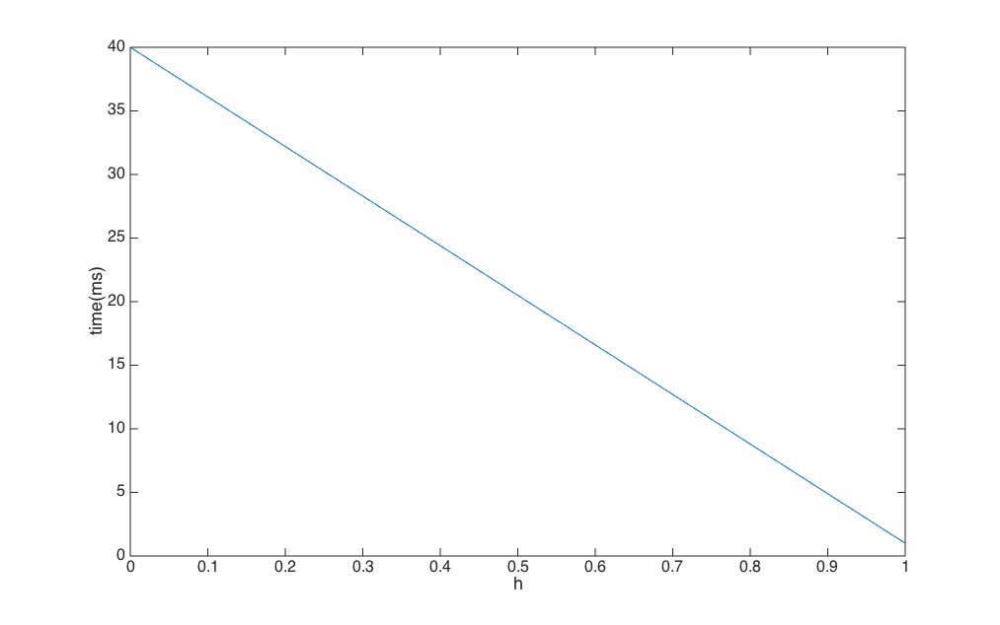

Assignment 4
====
###包昱嘉 5120719015
___

### 1
文件头以特定的魔数开始，表明该文件是一个可执行的文件，来放置非这种格式的文件偶然运行。在以前的UNIX机器上，文件的header往往是固定长度的，对于这些可执行文件，系统直接将其载入内存，并且从文件起始位置开始执行，位于起始位置的魔数其实便是一条转移指令，直接跳转到文件正文执行。
### 3
open系统调用的目的是把文件属性和磁盘地址表装入内存，在调用open系统调用后会返回一个文件描述符号，以便于后续调用的快速存取。如果没有open系统调用，每次我们要进行对于磁盘的读写操作时都需要重新获取文件的i-node号，获得文件的相关属性再进行相关读取写入操作，因为由于是频繁的调取i-node号，所以i-node号往往会在缓存中而不用去磁盘读取，没有open系统调用是可以的，但是必定会增加系统的工作量。
### 7
可以模拟。不妨令文件名为`/home/user1/temp.c`，虽然这个文件名看上去像是层次文件系统中的一个绝对路径，但这里面的`/`只是一个字符，来表示文件的层级关系。这样比如说我们要查看模拟的层次文件系统中`/home/user1`下的所有文件时，只需要查看所有以`/home/user1/`开头的文件名即可。
### 15
如果不含有存储地址的指针块，则十个直接地址，每个地址指向的磁盘块大小为1024KB，所以文件最大为10240KB即10MB。

如果考虑有一个存储地址的指针块，如果该指针块中存放的都是直接地址，则一共可以存放1024/4=256个直接地址。文件最大就可以有256+10=266个块。最大可能就是266MB。
### 18
硬链接不需要额外的磁盘空间，不需要占用新的i-node，只需要将对应文件的i-node节点的计数器加一即可。同时在访问时硬链接不会产生额外的开销，而符号链接每次访问都必须读取包含路径的文件，然后一个部分一个部分的扫描路径知道找到对应的i-node。

符号链接的优势在于它可以跨文件系统而不像硬链接只是单一的只能对应于同一个文件系统。只要简单的提供一个机器的网络地址以及文件在该机器上的路径，符号链接可以连接全球任何地方机器上的文件。同时当删除文件时，如果i-node的计数器并未被清零，用户是无法知道该文件还被那些对应的目录项引用，使用符号链接当删除了原文件后，所有对应的符号链接都将实效。
### 27
平均时间为对应概率乘以时间之和：
$$h+(1-h)\times40$$
作图如下：

### 33
1. 查看`/`的目录项
2. 查看`/usr`的i-node
3. 查看`/usr`的目录项
4. 查看`/usr/ast`的i-node
5. 查看`/usr/ast`的目录项
6. 查看`/usr/ast/courses`的i-node
7. 查看`/usr/ast/courses`的目录项
8. 查看`/usr/ast/courses/os`的i-node
9. 查看`/usr/ast/courses/os`的目录项
10. 查看`/usr/ast/courses/os/handout.t`的i-node

所以总共需要进行10次磁盘读取。

