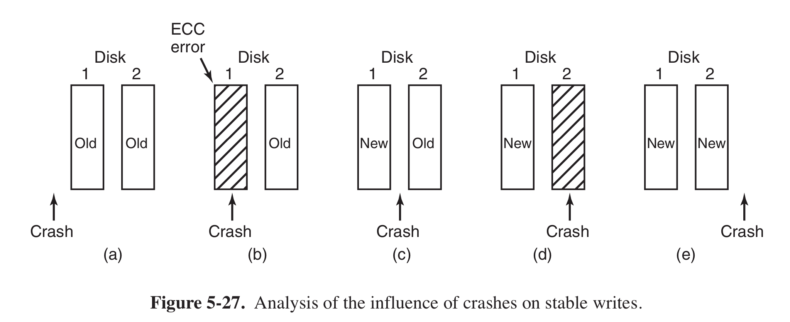
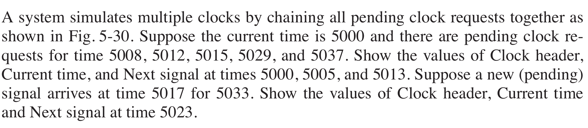

Assignment 5
====
###包昱嘉 5120719015
___
### 10
在UNIX系统中是这样完成的：有一张设备序号的表，表的每一项都是一个C的结构体，其中包含了指向对设备进行打开、关闭、写入、读取等操作的函数的指针（往往指向新设备对应的驱动程序）。当新的设备装载到系统时，操作系统会记录下这张函数指针表的地址，当操作系统需要调用一个函数时，它可以通过这张表格发出间接调用。

### 13
加入一个进程打开打印机，然后很长时间不实用，则其它进程都无法打印。为了避免这种情况，可以创建一个守护进程，以及一个假脱机目录。当进程要打印文件时，将生成的文件放在假脱机目录下，由守护进程打印该目录下的文件，这样就可以解决某些进程不必要的长期空占打印机。

### 19
对于读取的话可能是有用的。如果大部分的数据逻辑上都是连续存储的，那么通过合适的交错编号（取决于磁盘向内存复制的时间长短），可以使的当准备读取下一个扇区时磁头正好在恰当的位置。

当然如果没有内部缓冲，磁盘的写入读取性能会大大降低。一旦有请求后磁盘就必须立即写入或读取数据，造成磁盘的频繁读取，并且会对磁盘有损害。

### 24
1. 先来先到服务  
20（初始位置，不读）-> 10 -> 22 -> 20 -> 2 -> 40 -> 6 -> 38  
共需移动146个柱面，$146\times6=876$ msec
2. 最近柱面优先  
20（读）-> 22 -> 10 -> 6 -> 2 -> 38 -> 40  
共需移动60个柱面，$60\times6=360$ msec
3. 电梯算法  
20（读）-> 22 -> 38 -> 40 -> 10 -> 4 -> 2
共需移动58个柱面，$58\times6=348$ msec

### 25
因为对于最坏情况，如果请求的柱面为第一个柱面，且初始磁臂位于第二个柱面，另有一个请求的柱面是最后一个柱面。那么当访问到第一个柱面的时候需要扫描两次全磁道。而如果沿着相同方向扫描则只要扫描一次全磁道就可以了。

### 27

一共会产生上图所示的五种可能存在的情形：

+ a) 不需要恢复。
+ b) 如果CPU在由2向1拷贝的过程中崩溃，那么系统会检测到磁盘1上存在ECC error，当系统恢复后会重新从2向1拷贝；如果CPU在由2向1拷贝完成后崩溃，由于此时已经完成拷贝，所以其实已经是状态e)，不需要进行恢复。
+ c) 如果CPU在由1向2拷贝的过程中崩溃，那么系统会检测到磁盘2上存在ECC error，当系统恢复后对磁盘进行ECC校验发现磁盘2存在error，此时变为了状态d)，按照状态d)来处理；如果CPU在由1向2拷贝，由于此时已经完成了拷贝，所以其实已经是状态e)，不需要进行恢复。
+ d) 如果CPU在由1向2拷贝的过程中崩溃，那么系统会检测到磁盘2上存在ECC error，当系统恢复后会重新从1向2进行拷贝；如果CPU在由1向2拷贝完成后崩溃，由于此时已经完成拷贝，所以其实已经是状态e)，不需要进行恢复。
+ e) 不需要恢复。

综上，在恢复的过程中即使CPU再次崩溃，磁盘仍然可以恢复到一个一致的状态。

### 28
$$\frac{2/1000}{1/60}=0.12=12\%$$
所以CPU用语时钟处理的时间比例为$12\%$

### 30
原中文第三版教材中题目有缺少，原版书中题目如下：

+ 当前时间 5000  
下一个信号 8  
时钟头 --> 8 --> 4 --> 3 --> 14 --> 8
+ 当前时间 5005  
下一个信号 3
时钟头 --> 3 --> 4 --> 3 --> 14 --> 8
+ 当前时间 5013  
下一个信号 2
时钟头 --> 2 --> 14 --> 8
+ 当前时间 5023  
下一个信号 6
时钟头 --> 6 --> 4 --> 4
