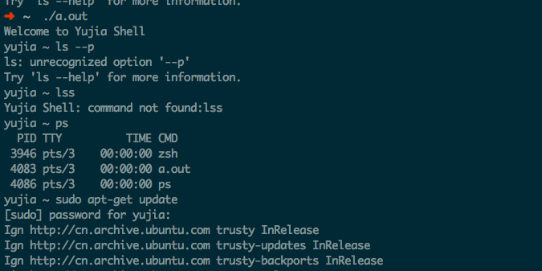

### OS Shell Project
包昱嘉 5120719015
___
声明：此shell由本人通过互联网查询相关系统调用函数参数及作用后完全独立完成。  

___
#### 设计思路：
主要使用fork-exec-waitpid-exit模型来完成简单的shell，对于无名管道的实现使用pipe-fork来实现。以下是各个函数设计的思路：  
**main**：//主函数，无参数

1. 输出提示符
2. 通过fgets获取用户输入的内容
3. 判断是否为内部命令cd，exit，若是则用主进程执行
4. 创建子进程执行外部命令，结束后输出提示符

**process_command:**//外部命令执行，参数为用户输入的字符串，返回void

1. 创建子进程
2. 子进程通过"|"分割命令，并通过迭代来执行命令
3. 父进程等待子进程退出后返回

**iterate_pipe:** //通过迭代完成管道

1. 如果只剩一条命令，则通过空格来分离命令的参数，执行命令
2. 如果不止一条命令，说明需要创建管道，通过pipe－fork创建子进程
3. 子进程更改标准输出，通过空格来分离命令的参数，执行命令的并退出
4. 父进程更改标准输入（得到子进程的输出结果），进一步向后迭代  
例：ls -l |grep a|grep b  
父进程创建子进程1，子进程1完成ls －l，将输出结果通过管道输送给父进程后结束。父进程向下迭代，创建子进程2，子进程2的输入来自子进程1的ls －l，执行grep a后将输出传给父进程，父进程继续向下迭代，此时只剩下最后一条命令，所以由父进程执行，其输入来自子进程2的输出，输出到标准输出。（注意，此时所知的父进程为process_command中创造的子进程，所以即使这里的父进程不会影响到shell主进程的运行）

**printpwd:** 

1. 获取当前用户的工作目录
2. 输出（如工作目录为"/home/user1"，则屏幕显示提示符为"user1 ~ "）

___
#### 实现伪代码
main函数：

	int main()  
	{  
		输出提示输入符号printpwd
		while（输入字符读取成功）
		{
			if(字符串长度为1)//只输入了回车
				进入下一个循环;
			if(字符串长度达到了buf最大长度)
				输出提示“command too long”
				进入下一个循环
			else if(字符串为"exit")
				执行exit(0)
			else if(字符串前两位为cd，第三位为换行符或空格)
				按空格分割字符串得到字符串数组argv[]
				if(argv只有一个元素)//即命令cd
					获取当前用户默认目录
					将工作目录切换到该目录
				if(argv有两个元素)//cd dirctory
					将工作目录切换到dirctory
					if(切换失败)
						错误输出"illegal address"
				else
					错误输出"illegal address"
				输出提示输入符号printpwd
			else
				处理外部命令process_command
				输出提示输入符号printpwd
		}
	}
					
process_command函数：

	void process_command(char* buf)
	{
		将字符串最后一位换行符设为0
		if(pid = fork()<0)
			//fork 失败
			错误输出"fork error"
		else if(pid == 0)
			//子进程
			按“｜”来分割字符串,结果存入字符串数组commands//分割管道
			执行迭代函数iterate_pipe(commands,num_pipe + 1,1)
		else	
			//父进程
			waitpid(pid, &status, 0) //等待子进程退出
		return
	}

iterate_pipe函数：

	void iterate_pipe(char* commands[], int total_num, int current_num){
		if (current_num == total_num)
			//迭代终止
			按空格分割字符串，结果存入数组argv
			result ＝ execvp(argv[0],argv)//执行命令
			if (result == -1)
				//执行失败
				错误输出“command not found”
				exit(1)
		else
			//要创建管道
			if(pipe(pipe_fd) == -1)
				//管道创建失败
				错误输出"Create pipe error."
				exit(1)
			if((child_pid = fork()) != 0)
				//父进程
				waitpid(child_pid, &status, 0)//等待子进程结束
				//子进程结束后，修改标准输入
				close(pipe_fd[1])
				close(STD_INPUT);
				dup(pipe_fd[0]);
				close(pipe_fd[0]);
				iterate_pipe(command, total_num, current_num + 1);//向后继续迭代
			else
				//子进程
				//更改标准输出
				close(pipe_fd[0])
				close(STD_OUTPUT)
				dup(pipe_fd)
				close(pipe_fd[0])
				按空格分割字符串得到字符串数组argv[]
				result ＝ execvp(argv[0],argv)//执行命令
				if (result == -1)
					//执行失败
					错误输出“command not found”
					exit(1)
	}
			
printpwd函数：

	void printpwd()
	{
		获取当前工作目录存入pwdbuf
		按"/"来分割pwdbuf
		输出pwdbuf最后一个/后的字符，并输出"~" 作为提示符号
		//输出结果： 如果当前工作目录为/home/user， 提示输入符号为："user ~ "
	}
	
___
####运行截图
在gcc (Ubuntu 4.8.2-19ubuntu1) 4.8.2下编译通过，成功运行  
  

执行`pwd`命令查看当前工作目录  
执行外部命令`ls -l`语句  
执行内部命令`cd MATLAB`进入当前目录下的MATLAB文件夹  
执行内部命令`exit`退出shell
  

测试输入错误的外部命令`lss`  
测试参数输入错误的外部命令`ls --p`  
测试外部命令`ps`  
测试debian环境中的外部命令`sudo apt-get update`(此部分由于列表过长分两段截图)  
  

测试外部命令`sudo chmod 666 yujia.c`,并通过`ls -l`检查结果
  

测试管道：  
`ls`查看当前目录文件  
`ls|grep a` 测试无名管道  
`ls|grep a|grep at` 测试多个管道  
测试错误命令：  
`ls|grepa| grep a`  
`lss|grep a|grep at`  
`ls|grep a|grept`  

___
####结果分析
经过测试，这个简单的shell能够处理一般简单的外部命令和内部命令cd，exit。同时对于多个连续管道也提供了支持，对于一些错误命令的输入也能进行判别，基本运行比较稳定。

进一步可以考虑使用`getchar()`来替换`fgets()`，通过实时的读取输入的字符，可以实现向上向下键的history功能，也可以进一步实现tab功能。