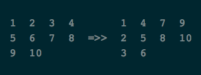
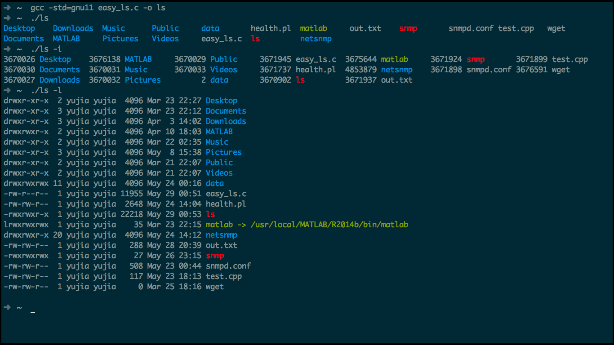
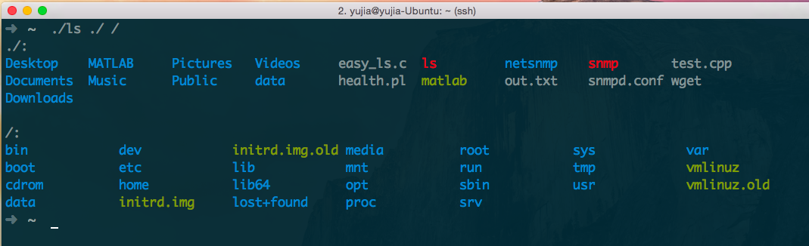
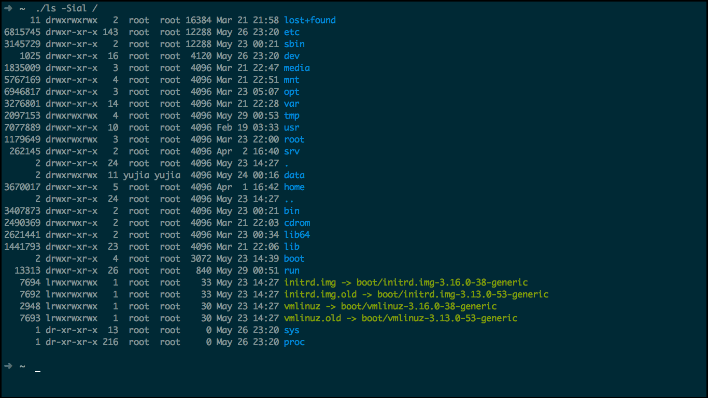
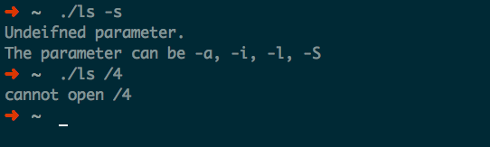
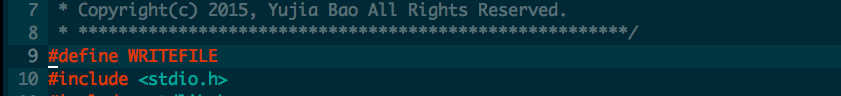
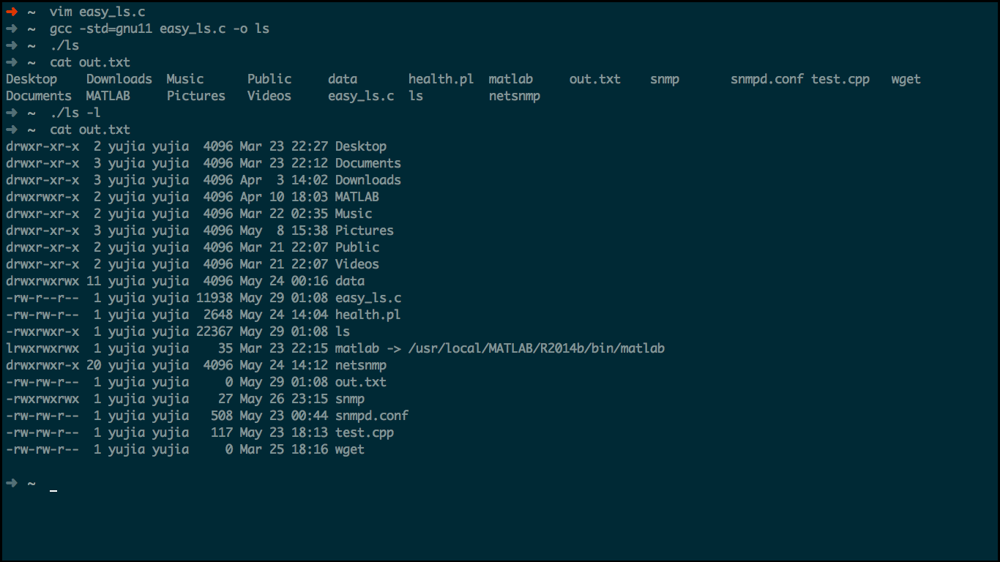
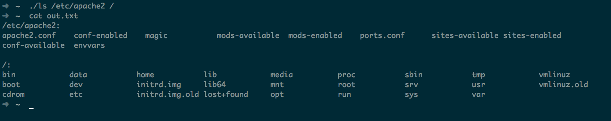
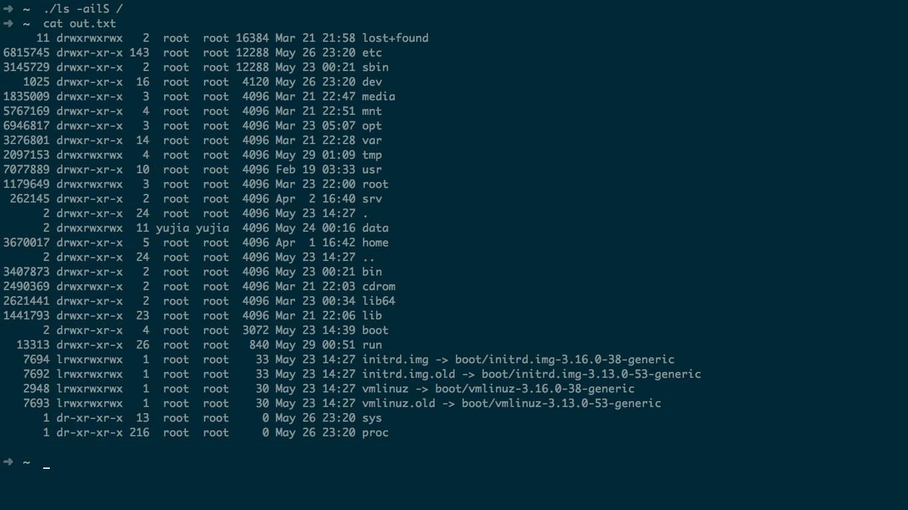

# OS Shell Project2
### 包昱嘉 5120719015
*声明：作业由本人独立完成*
___
## 设计思路
主要通过`opendir()` `readdir()` `lstat()` `closedir()`完成对文件目录项的信息读取。另外自己又仿照系统的`ls`做了一些改进。主要实现了系统的`ls -l -i -S -a`这四个参数的功能，另外对于输出结果进行了排序，对文件夹、符号链接以及可执行文件用了不同的颜色进行区分。同时针对不同窗口大小的终端调节了输出的顺序，使得输出结果非常美观。当然这些在输出到文本之后是无法辨识的。

由于一开始是设计为命令行的程序的，并没有考虑到向文件输出。所以后面在进行改动的时候我使用`freopen()`关闭了标准输出，将输出重定向为给定文件来实现向文本输出。为了保留之前的命令行输出的版本，也可以选择通过程序前的`#define WRITEFILE`来控制是讲结果输出到屏幕还是文件`out.txt`

程序功能的实现其实是非常简单的，但是在如何美化输出上花了不少功夫

以下是各个函数设计的思路：

**struct paraflag**   
作用：用于表示用户输入的参数

**int strlen_custom (char *c)**   
作用：为了输出美观，统计文件名中的字符显示长度。由于中文字符在utf－8中占3位，所以需要区分处理

**int getlength (unsigned long long x)**  
作用：计算longlong整形的长度

**char * splitstr(char *dst, char *src, int n, int m)**  
作用：分割字符串，由于得到的文件修改时间包含信息过多，所以需要分割

**void translate_mode(mode_t x, char result[])**  
作用：将保护位的十进制表示的八进制信息转化为我们所熟知的10位dwrxwrxwrx字符串

**void qsortchar(int s[], char name[][1000], int l, int r)**  
作用：对于文件名进行快速排序

**void qsortint(int s[], unsigned long long t[], int l, int r)**  
作用：对于整形进行快速排序（由于输入的数据有所不同所以无法和qsortchar做成一个模版函数）

**int change_vertical(int x, int remainder, int perlen, int lines)**  
作用：由于系统`ls`输出是按竖列排的，同时我认为这样排列是比较科学看起来比较舒服的。所以这里作了一个转化的函数，具体的细节会在后面提到。

**int main(int argc, char *argv[])**  
作用：读取用户输入参数，根据用户输入的参数要求列出用户输入地址下的文件目录项，并输出（命令行或者一指定文件）

###关于文件输出顺序的排序  
这一部分并不是程序的重点，但是可能有牵涉一些索引表，所以还是罗列介绍一下：  
首先namelist,hardlist,protectlist,uidlist,gidlist,sizelist,timelist,inodelist这些分别对应文件的一些属性。排序的时候是根据namelist进行排序，如果同时需要变动其他列表的值将使的效率大大降低，这里我重新初始化了一个数组sortedlist，初始时sortedlist[i]=i。在排序的时候我不通过namelist[sortedlist[i]]来访问文件名，并不改变namelist的顺序，只是对sortedlist进行重新排序。排序结果sortedlist[0]即对应namelist中字典序排列最小的值的index。如下所示：  
>namelist ＝ { "Panda", "Apple", "Banana"}  
>sortedlist = { 1, 2, 0}  

我可以通过namelist[sortedlist[0]],namelist[sortedlist[1]],namelist[sortedlist[2]]分别从小到大获得文件名。对于其他hardlist之类的数组也可以同样的获得对应的数值。

### 关于文件的竖直输出
之后可能涉及到的就是如何竖直输出,因为在一般的没有输入`-l`的参数时`ls`命令是需要将文件逐个输出而不是单个文件独占一行。这一点我首先是通过了`ioctl()`来获取当前终端的大小，另外在通过对于要输出的文件数量进行了统计，再将每个输出元素的最大长度（因为可能有的文件名很长，有的很短，需要进行对齐）进行了计算。之后将其从原始的横排转化为竖排，如下所示：
 

## 程序伪代码
部分函数都是比较基础的，代码也很短，这里就不详细罗列了

**paraflag**

	struct paraflag{
		int a; //参数a
		int i; //参数i
		int l; //参数l
		int S; //参数S
	}
**strlen_custom**

	int strlen_custom(char *c){
		int num_cc = 0;
		for (i从0到c的长度)
			如果 c[i] > 127 或者 c[i] < 32 //ASCII码中非键盘字符
				num_cc++
		return c的长度-num_cc/3 //每个中文字符占3个char，但是输出时占2个位宽
	}

**translate_mode**

	void translate_mode(mode_t x, char result[]){
		switch(m的最后一位)
			case 1 后三位读写为"--x"
			case 2 后三位读写为"-w-"
			case 3 后三位读写为"-wx"
			case 5 后三位读写为"r--"
			case 5 后三位读写为"r-x"
			case 6 后三位读写为"rw-"
			case 7 后三位读写为"rwx"
		switch(m倒数第二位)
			同上
		switch(m倒数第三位)
			同上
		如果x长度为5
			switch(m的第一位)
				case 1 第一位为'p' 返回
				case 2 第一位为'b' 返回
				case 4 第一位为'd' 返回
		其他:
			如果长度为6
			 switch(m的第一位)
			  case 0 返回
			  case 2 第一位为'l' 返回
			  case 4 第一位为's' 返回
			  default 返回
	}
**change_vertical**
	
		int change_vertical(int x, int remainder, int perlen, int lines){
			//remainder 最后一行的元素数量
			//perlen 每一行的元素数量
			//lines 完整的行数
			算出x元素横向排列时所除的列数和行数
			如果列数大于最后一行元素的数量
				返回 (lines+1)*remainder + lines*(column-remainder-1) + row - 1
			else
				返回 row + ((lines+1)*(column-1)) - 1)
		}
		
**main**

	int main(int argc, char *argv[]){
		读取终端窗口大小
		扫描用户输入的参数，如为`-l`,`-i`,`-a`,`-S`或者`-ail`等等参数将结果存入类型为struct paraflag的变量para中，如果为地址，则记录当前用户输入地址的数量
		获取当前程序工作目录
		创建数组dirlist用于存放用户所要查看的地址，如果地址不是绝对路径，则在地址前加上当前工作目录
		如果定义了WRITEFILE，则将输出转向到out.txt文件
		遍历dirlist
			打开地址，如果失败返回1
			读取地址中的每个文件，记录文件数，关闭打开
			根据之前的文件数，创建数组，分别用于记录文件名，时间，uid，gid，保护位，硬链接，inode，大小。同时为了输出美观，创建变量分别记录这些文件前面这些信息的最大输出长度。
			再次打开地址，读取其中每个文件，将数据分别记录到前面创建的数组中，关闭打开
			根据para变量中a的取值来决定输出的文件数目，以便于可以竖型按字典序完美输出
			调用qsortchar对namelist进行快速排序
			如果用户输入参数`-S`则在按照大小进行排序
			调用change_vertical对输出顺序进行转化
			将j从0遍历到输出文件数－1
				如果para.l ＝＝ 0，则读取sortedlist[j]；否则读取vertical[j]
				如果para.a为1或者文件名第一位不是'.'
					如果para.i ＝＝ 1 输出inode
					如果para.l ＝＝ 1 按列依次输出
					否则 按行数依次输出，当到了一行输出的元素数时换行
		如果定义了WRITEFILE，关闭文件
		return
	}
	
##运行测试：
*使用gcc在Ubuntu 14.04下编译通过*  
这里是命令行模式的运行情况,图中蓝色表示文件夹，绿色表示符号链接，红色表示可执行文件，可以看到所有的输出都是竖列按照字典序进行排列，十分美观。同时也按照系统的`ls`输出了相同的结果

同时这里是多个路径的输出结果，可以看出输出的排版可以根据窗口和输出文件名进行自动调节

这是对于支持的四种参数的展示，通过`-S`参数表示文件从大到小排序

之后是对于程序稳定性的测试，发现程序对于一些错误的输入也会进行相应的提示

接下来展示项目要求的输出到文件模式的运行情况，只需要取消`#define WRITEFILE`前的注释即可切换为输出到文件模式的版本

可以看到同样正常通过编译。输出到文件`out.txt`

同样支持各种参数以及多个文件路径

## 结果分析
目前这个`easy_ls`工具在一定程度上已经和系统自带的`ls`有了极其相似的功能，同时在使用上可以通过自定义的颜色更加直观的表述文件信息。整体运行情况比较稳定，没有出现什么问题。在完成的过程中自己查阅了许多相关的manual文档以及各种API，对于部分系统调用以及`struct stat`有了深入的了解。同时在处理输出数据格式的时候，极大的锻炼了我对于`c`字符串各种处理以及一些相关算法。总之，收获颇丰！

进一步可以考虑增加对于一些其他参数的支持，同时可以考虑进一步优化代码。